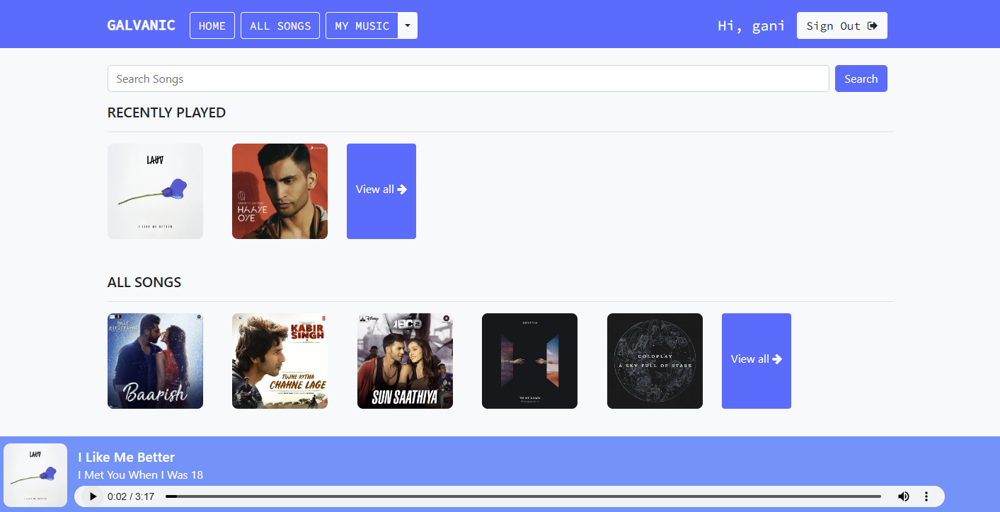

# Music-Player  --  Django based music streaming website


 

[](https://github.com/ganeshsriprasad/Music-Player/commits/main)
[](http://badges.mit-license.org)

A Django-based Music Player with features for adding songs to favorites and creating custom playlists provides users with a personalized music experience through a web interface. The application enables users to manage, and listen to their music while organizing their collections into playlists and marking their favorite tracks.


## Features 📋
⚡️ SignUp and SignIn option.\
⚡️ Google SignUp and SignIn option.\
⚡️ Play song, view detailed information of song.\
⚡️ Search songs.\
⚡️ Filter songs based on language and singer.\
⚡️ Create new playlist.\
⚡️ Add/Remove songs to/from playlist.\
⚡️ Add/Remove songs to/from favourites.\
⚡️ Scroll through recently played/viewed songs.\
⚡️ Explore songs through your personalized playlist and favourites.

## Tech Stack:

Backend: Django (Python) for user management, music file handling, and database management.

Frontend: HTML, CSS, JavaScript for the audio player and user interface.

Database: SQLite to store user data, song metadata, favorites, and playlists.


### Website Preview

#### Home Page


#### Authorised user page



#### Detail Page


----


## Installation 📦

### Clone the Repository

Clone this repository to your local machine using Git:

```bash
git clone https://github.com/ganeshsriprasad/Music-Player
```

# Create and Activate a Virtual Environment
A virtual environment is recommended to isolate the project dependencies. Follow the steps below:

## Navigate to the project directory:
```shell
cd Music-Player
```

## Create a virtual environment.
```bash
python -m venv myenv
myenv\Scripts\activate
```

Once activated, your terminal prompt will change to show the virtual environment name.
## Install Dependencies
With the virtual environment activated, install the required dependencies using pip:
```bash
pip install -r requirements.txt
```

## Dont forget migrations

```shell
python manage.py makemigrations
python manage.py migrate
```

## Run the Development Server
To start the development server, use the following command:
```bash
python -m manage runserver
```


### You can now access the website at http://127.0.0.1:8000/ in your browser.


This music player provides a basic, yet powerful, platform for managing and enjoying music collections online, with features that allow for personalized music experiences through favorites and custom playlists.

---

## Contributing 💡


#### Step 1

- **Option 1**
    - 🍴 Fork this repo!

- **Option 2**
    - 👯 Clone this repo to your local machine.


#### Step 2

- **Build your code** 🔨🔨🔨

#### Step 3

- 🔃 Create a new pull request.


## License 📄
This project is licensed under the MIT License - see the [LICENSE.md](./LICENSE) file for details.
